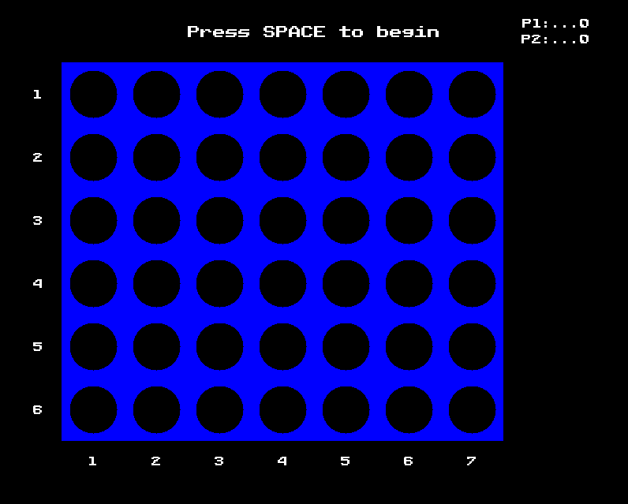

# Project 04 – Connect Four
 
## 🕹️ Description
 
This is a turn-based grid game written in C++ using SDL2. Players take turns placing pieces using the keyboard and/or mouse.

The goal of this game is to get FOUR of your pieces to connect horizontally, vertically, or diagonally.

To play, players will take turns dropping a piece in a column of their choosing. This piece will fall to the lowest open slot
in that column. For example, if a player drops their piece in column one and is the first to do so, their piece will slide all
the way to the bottom. As for if their are already pieces in a column, if a player drops their piece in column one and there
is already a piece in the bottom slot and the slot above that, then their piece will drop into the third slot in that column.

**TLDR of above paragraph, players take turns dropping their piece into columns. The pieces will stack on top of each other. 
This will repeat until a player gets FOUR of their pieces to connect.**

## 🎮 Controls
 
1. Press SPACE to start the game. The board will initially display and be dormat until SPACE is pressed.
2. LEFT CLICK in the corresponding column you would like to drop your piece.
3. After clicking, the piece will be played if possible then start the next players turn.
4. Repeat step 2 and continue until the game is finished.
5. Press SPACE to restart the game or close the window to stop playing.
 
## 🧪 Screenshot
 

 
## ✨ Extra Features
 
- Flashing information at the top of screen
- Keep score in top right of screen
- Row and Column numbers
- Circles for board slots and pieces